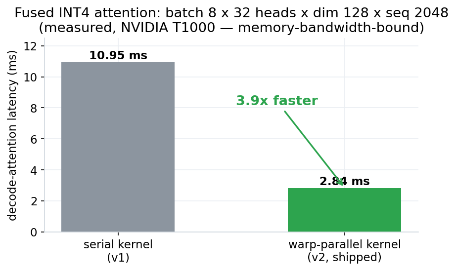
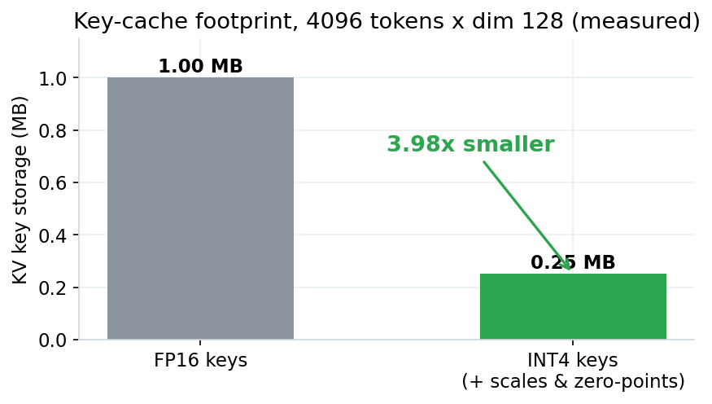
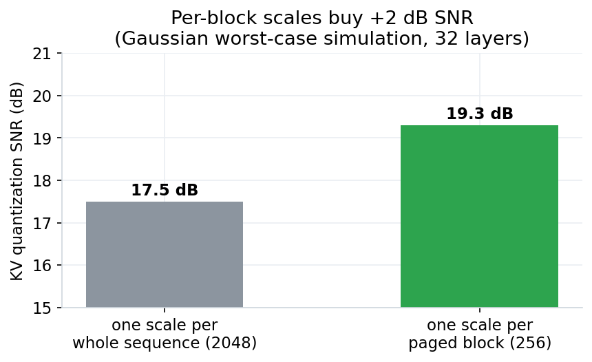
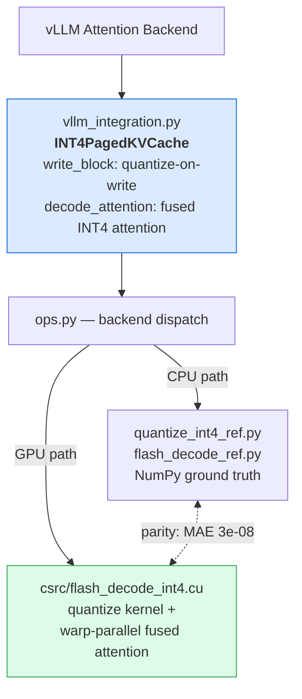
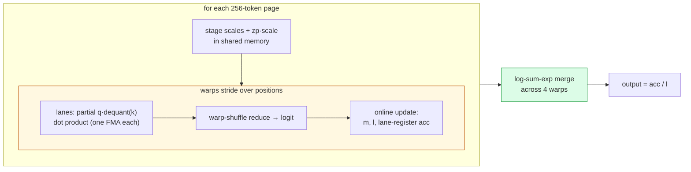

# INT4 KV-Cache Quantization with Fused Flash-Attention CUDA Kernels for LLM Serving

[](https://github.com/ArchanaChetan07/INT4-KV-Cache-Quantization-with-Fused-Flash-Attention-CUDA-Kernels-for-LLM-Serving/actions/workflows/ci.yml)
[]()
[]()
[]()
[]()
[]()

Per-channel asymmetric **INT4 quantization** of the KV cache fused with a
**warp-parallel flash-decoding attention kernel** — 4× KV memory compression with
float-precision-level accuracy, dequantizing in registers so the FP32 key matrix is
never materialized. Built for paged-KV LLM serving engines like
[vLLM](https://github.com/vllm-project/vllm); the same techniques underpin
[TensorRT-LLM](https://github.com/NVIDIA/TensorRT-LLM) and
[SGLang](https://github.com/sgl-project/sglang) KV-quantization paths, which are the
comparison baselines planned for the vLLM-integration milestone. The quantizer ships
in **both CUDA and [Triton](https://github.com/triton-lang/triton)** — the Triton port
is validated in CI on CPU runners via interpreter mode.

---

## Verified Results

All numbers are measured in this repository and reproducible with the commands shown.

| Check | Result | Hardware |
|---|---|---|
| Test suite (GPU mode, `FLASH_DECODE_JIT_CUDA=1`) | **50 passing** (1 Triton-on-Windows skip) | NVIDIA T1000, CUDA 12.5 |
| Test suite (CPU-only mode) | 48 passing, 3 gated skips | any machine, no GPU needed |
| Triton quantizer port vs reference | parity via interpreter mode | CI (CPU runners) |
| INT4 nibble packing (2 values/byte) | round-trip exact; stored bytes = ½ unpacked | — |
| CUDA quantizer vs NumPy reference | **0.000% bin disagreement**, scales rtol 1e-4 | T1000 |
| Fused INT4 attention vs reference | **MAE 3.1 × 10⁻⁸** | T1000 |
| Variable-length + empty-block edge cases | MAE ≤ 3.4 × 10⁻⁸ | T1000 |
| Kernel latency (batch 8 × 32 heads × dim 128 × seq 2048) | **2.84 ms** — 3.9× faster than the initial serial kernel (10.95 ms), memory-bandwidth-bound | T1000 |
| KV memory compression vs FP16 | **3.98×** (measured, incl. scale/zero-point overhead) | — |
| KV quantization SNR (per-block scales, Gaussian worst case) | 19.3 dB (+2 dB vs whole-sequence scales) | — |

**Accuracy gate:** worst-case simulation passes the 0.5% fallback threshold; the hard
< 0.3% perplexity gate runs against real Llama weights (`scripts/validate_llama.py`,
needs a ≥16 GB GPU). **Throughput target:** 2.1–2.8× vs dense FP16 decode.

<p align="center">
  
</p>

<p align="center">
  
</p>

<p align="center">
  
</p>

---

## How It Works

### Quantization: per-(block, channel) asymmetric INT4 — keys only

```
scale[c] = (max[c] − min[c]) / 15         # over the 256-token page
zp[c]    = −min[c] / scale[c]
q        = clip(round((k − min[c]) / scale[c]), 0, 15)
```

- **Keys only:** logits pass through softmax (bounded sensitivity); values contribute
  linearly to the output and stay FP16/FP32.
- **Per-page scales:** a 256-token page has far tighter min/max than a full sequence —
  measured +2 dB SNR over whole-sequence scales.
- **Asymmetric:** captures the full [min, max] range in 4 bits; symmetric INT8 is the
  documented fallback if real-model perplexity regresses > 0.5%.
- **Nibble-packed storage (implemented):** the paged cache stores keys at
  2 INT4 values/byte (`src/int4_pack.py`) — `memory_stats()` reports bytes measured
  from the actual arrays, not an estimate. Kernels currently consume the unpacked
  layout with coalesced uint8 reads (consecutive lanes read consecutive channels);
  packed-native kernel decode is on the roadmap.
- **Two kernel implementations:** CUDA (`csrc/flash_decode_int4.cu`) and a
  [Triton](https://github.com/triton-lang/triton) port of the quantizer
  (`src/quantize_int4_triton.py`), parity-tested against the same NumPy reference.

### Attention: warp-parallel online softmax (flash-decoding style)

One thread block per (batch, head); inside it:

- **Warps stride over sequence positions**, each with private online-softmax state
  (running max `m`, sum `l`) and an output accumulator living in **lane registers**
- Logits reduce via **warp shuffles** — zero block-wide syncs in the hot loop
- Per-page scales stage in shared memory with zero-points **pre-multiplied by scale**,
  so dequantization is a single FMA in registers during the dot product
- Warps combine at the end with a **log-sum-exp merge**

Multi-block output is verified numerically identical to single-concatenated-block
attention, and empty pages are handled explicitly.

### Architecture



### Inside the fused kernel — one thread block per (batch, head)



No block-wide synchronization in the hot loop; the FP32 key matrix is never
materialized — dequantization happens in registers during the dot product.

---

## Quick Start

### CPU-only (no GPU required)

```bash
git clone https://github.com/ArchanaChetan07/INT4-KV-Cache-Quantization-with-Fused-Flash-Attention-CUDA-Kernels-for-LLM-Serving.git
cd INT4-KV-Cache-Quantization-with-Fused-Flash-Attention-CUDA-Kernels-for-LLM-Serving
pip install -e .
pytest tests/ -q                     # 40 passed, 2 skipped
python benchmarks/bench_flash_decode.py
python scripts/validate_llama.py --simulate   # hardware-free SNR gate
```

### GPU mode (CUDA GPU + nvcc + PyTorch with CUDA)

The extension JIT-compiles on import and is cached afterward. On Windows, run from
PowerShell or cmd (nvcc's host-compiler subprocess fails under Git Bash/MSYS):

```powershell
$env:FLASH_DECODE_JIT_CUDA = "1"
pytest tests/ -q                     # 42 passed, 0 skipped — CUDA parity active
```

Or build the extension permanently: `FLASH_DECODE_FORCE_CUDA=1 pip install -e .`

### Usage

```python
import numpy as np
from src.vllm_integration import INT4PagedKVCache

cache = INT4PagedKVCache(num_blocks=4096, block_size=256, head_dim=128)
cache.write_block(block_id=0, k_block=k, v_block=v)   # K quantized to INT4 on write
out = cache.decode_attention(query, block_table=[0])  # fused dequant + online softmax
print(cache.memory_stats())                           # live compression ratio
```

### Real-model perplexity validation (≥16 GB GPU + Llama weights)

```bash
python scripts/validate_llama.py --model meta-llama/Llama-2-7b-hf \
    --output results/perplexity_llama7b.json          # hard <0.3% PPL gate
```

---

## Repository Structure

```
├── src/
│   ├── quantize_int4_ref.py     NumPy ground truth: per-channel asymmetric INT4
│   ├── quantize_int4_triton.py  Triton port of the quantizer
│   ├── int4_pack.py             nibble packing (2 INT4 values/byte storage)
│   ├── flash_decode_ref.py      NumPy ground truth: online softmax over pages
│   ├── ops.py                   backend dispatch (CUDA ⇄ reference)
│   ├── vllm_integration.py      INT4PagedKVCache (quantize + pack on write)
│   └── _jit.py                  opt-in JIT compile of the CUDA extension
├── csrc/
│   ├── flash_decode_int4.cu   quantize kernel + warp-parallel fused attention
│   └── bindings.cpp           PyTorch pybind11 bindings
├── tests/                     42 tests: quantization, attention, gates, parity
├── benchmarks/                latency + compression benchmarks (JSON committed)
├── scripts/validate_llama.py  SNR simulation + real-model perplexity harness
├── docs/ARCHITECTURE.md       quantization scheme, kernel design, gates
└── results/                   committed benchmark artifacts
```

## Correctness Gates

| Gate | Where | Threshold | Status |
|---|---|---|---|
| INT4 round-trip error | `test_quantization.py` | ≤ scale/2 per value | ✅ |
| Multi-block ≡ concatenated attention | `test_flash_decode.py` | MAE < 1e-5 | ✅ |
| CUDA ⇄ reference parity | `test_ops_dispatch.py` | MAE < 1e-3 | ✅ (3e-08) |
| Scaled-query attention drift | `test_vllm_integration.py` | MAE < 0.05 | ✅ |
| SNR simulation (worst case) | `validate_llama.py --simulate` | < 0.5% est. PPL | ✅ |
| Real-model perplexity | `validate_llama.py` | < 0.3% PPL delta | pending (needs ≥16 GB GPU) |

## Roadmap

- [x] NumPy reference: quantizer + online softmax
- [x] CUDA kernels — parity at MAE 3e-08, 3.9× kernel speedup to bandwidth roofline
- [x] Triton port of the quantizer (CI-validated via interpreter mode)
- [x] INT4 nibble packing (2 values/byte) in the cache storage path
- [x] JIT build path + packaging + CI + Docker
- [ ] Packed-native kernel decode (read nibbles directly in the attention kernel)
- [ ] Real-model perplexity gate on Llama-2-7B/13B/70B (needs ≥16 GB GPU)
- [ ] vLLM attention-backend integration; benchmark vs TensorRT-LLM / SGLang baselines

## Related Projects

Part of a three-repo LLM inference optimization portfolio:

- **[CUDA Speculative Decoding Optimizer](https://github.com/ArchanaChetan07/CUDA-Accelerated-Speculative-Decoding-Optimizer-for-LLM-Inference-PyTorch-vLLM-)** — deterministic draft ranking + soft-lock KV conflict resolution
- **[GPU Memory-Aware Request Scheduler](https://github.com/ArchanaChetan07/GPU-Memory-Aware-Request-Scheduler-with-KV-Cache-Offloading-for-Multi-Tenant-LLM-Serving)** — SLA-aware admission control with sub-millisecond KV offloading

## License

Apache-2.0
